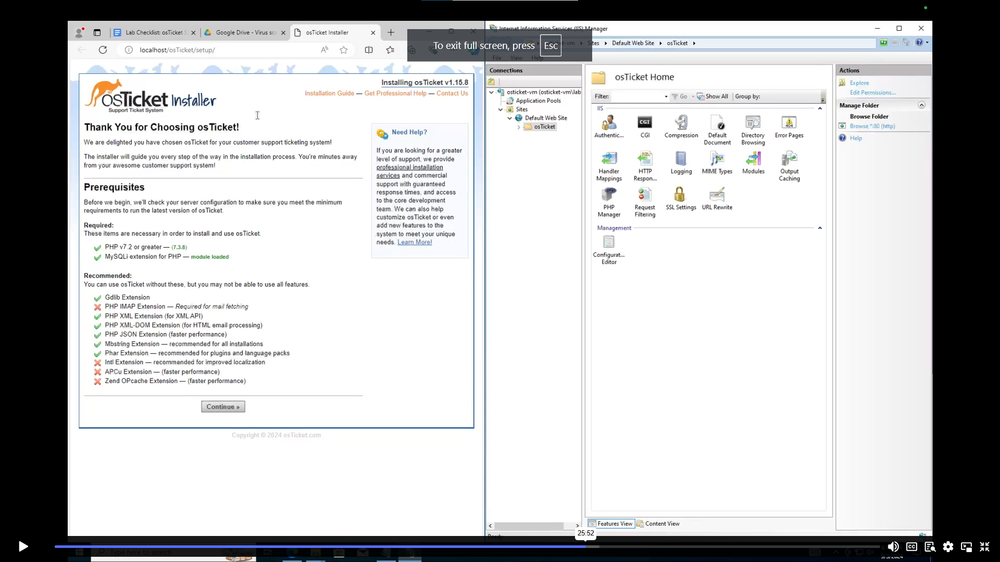

# osTicket-Installation

  
  

  
  <h1>osTicket - Prerequisites and Installation</h1>
  Setting Up osTicket on Azure Virtual Machine (Windows 10) This guide will walk you through creating an Azure VM and installing osTicket on it. 
  
  <h2>Before you start:</h2>
  
  - You need an Azure account with a subscription.
  - Be familiar with Azure and Windows Server basics.
  - An understanding of Remote Desktop Protocol (RDP)
  <h2>Operating Systems Used </h2>
  
  - Windows 10 Pro </b>
  
  <h2>List of Prerequisites</h2>
  
  - <b>PHP manager for IIS</b> - ensures PHP is correctly configured to run IIS
  - <b>Rewrite module </b> - facilitates URL rewriting and redirect users to URLs
  - <b>VC_redist.x86</b> (redistributable) - osTicket relies on libraries that are part of Microsoft Visual C++ and ensures the program runs smoothly
  - <b>MySQL</b> - for storing data into databases
  - <b>HeidiSQL</b> - interface for accessing MySQL 
  
  
  <h2>Installation Steps</h2>
  

  <h2>Step:</h2>
    
1. <b>Create the VM in Azure:</b>
<ul>
  <li>Go to the Azure portal and create a new resource named "osticket-vm" (Virtual Machine).</li>
<li>Choose your preferred region, resource group, and a plan with at least 4 vCPUs.</li>
<li>Select "Windows 10" (or later) and set a username and password.</li>
<li>Review settings and click "Create" to start the VM.</li>
  <li>Use a remote desktop client to connect with the credentials you set earlier</li>
</ul>
  
  

   
  

2. <b>Install software on the VM:</b>
    <ul>
   <li>Download <a href= https://drive.google.com/uc?export=download&id=1b3RBkXTLNGXbibeMuAynkfzdBC1NnqaD>osTicket-Installation-Files.zip</a> and unzip it on the desktop (creates a folder named "osTicket-Installation-Files").</li>
  
  

  

  
  

  
  
  

    
   <li>Enable IIS with CGI:
      <ol>Search for "Control Panel" and open it.</ol>
        <ol>click Uninstall a Program</ol>
        <ol>click Turn Windows features on or off</ol>
        <ol>check the box next to Internet Information Services(IIS).</ol>
        <ol>expand "Application Development Features" and check "CGI".</ol>
      </li>
    
  

   
  
  

  
  

   
  

  <li>Install additional software from the “osTicket-Installation-Files” folder:
    <ul>Double-click and install (select default setting for both):
      <ol>PHP Manager for IIS (PHPManagerForIIS_V1.5.0.msi)</ol>
      <ol>Rewrite Module (rewrite_amd64_en-US.msi)</ol>
    </ul>
  
  

  
  
   
  
  

  <ul>Create a new folder named "PHP" at C:\PHP.</ul>
<ul>Extract php-7.3.8-nts-Win32-VC15-x86.zip into the C:\PHP directory.</ul>
<ul>Install VC_redist.x86.exe and mysql-5.5.62-win32.msi from the same folder.</ul>
</li>
  

  

    
  

   
  
  

  <li>Configure MySQL:</li>
  <ol>During MySQL installation, choose "Typical Setup".</ol>
  <ol>After installation, launch the "MySQL Configuration Wizard" and select "Standard Configuration".</ol>
  <ol>Set username (root) and password (root) for MySQL access.</ol>
    
  

  

    
  

   
  
  

3. <b>Configure IIS for PHP:</b>
    <li>Open "IIS Manager" (search for it)and Run as administrator.</li>
    <li>Click on PHP manager then register new PHP version.</li>
    <li>Select C:\PHP\php-cgi.exe</li>
    
  

  

    
  

   
  
  

  <li>Click "OK" on all open windows and restart IIS (from Server Manager or IIS Manager).</li>
  

  

    
  

   
  
  

  4. <b>Install osTicket:</b>
  <li>Extract the contents of osTicket-v1.15.8.zip from the downloaded folder.</li>
  <li>Copy the extracted "upload" folder to c:\inetpub\wwwroot.</li>
  <li>Rename the copied folder from "upload" to "osTicket".</li>
  <li>Restart IIS.</li>
    

  

    
  

   
  
  

  Reload IIS again. On the left side pane, go to Sites, click the down arrow until you reach osTicket and then click on Browse in the right side pane, then you should get this.
  

  

    
  

   
  

5. <b> Configure osTicket:</b>
    <li>Open a web browser and go to http://localhost/osTicket.
    (You might see a message about missing extensions).</li>
    <li>Go back to IIS Manager, find your osTicket application, and double-click "PHP Manager".</li>
    <li>Click "Enable or disable an extension" and enable these extensions:</li>
    <ol>php_imap.dll</ol>
    <ol>php_intl.dll</ol>
    <ol>php_opcache.dll</ol>
    <li>Refresh the webpage and you should see osTicket configured!</li>
  

  

    
  

   
  

6. <b>Rename and Assing Permissions to ost-config.php</b>
  <li>RenameC:\inetpub\wwwroot\osTicket\include\ost-sampleconfig.php to C:\inetpub\wwwroot\osTicket\include\ost-config.php.</li>
  <li>Right-click on ost-config.php and select "Properties".</li> 
  <li>Go to the "Security" tab</li>
  <li>Advanced and Disable inheritance</li> 
  <li>Click Add Select a principal</li>
  <li>Type everyone in the box check names click OK.</li> <li>Make sure you click on Full control as well.</li>
  

  

    
  

   
  

7. <b>Continue the osTicket Setup in the Browser:</b>
<li>Click the "Continue" button.</li>
<li>Enter the following information:</li>
<ol>Name: Helpdesk</ol>
<ol>Default Email: (Your default email address)</ol>
<li>Install and Configure HeidiSQL:</li>
<ol>Navigate to the "osTicket-Installation-Files" folder.</ol>
<ol>Double-click the HeidiSQL installer and follow the on-screen instructions to install it.</ol>
<ol>Open HeidiSQL.</ol>
<ol>Create a new session (Accept all defaults):</ol>
<ul>Host: localhost
</ul>
<ul>User: root</ul>
<ul>Password: root</ul>
<ol>Click "Open".</ol>
<li>Create the osTicket Database:</li>
<ol>Right-click on the "Unnamed" node in the left pane.</ol>
<ol>Select "Create new"</ol>
<ol>Enter "osTicket" as the database name (must be exactly osTicket).</ol>
<ol>Click "OK"</ol>

  

  

    
    
  

8. <b>Complete the osTicket Installation:</b>
<li>Go back to the osTicket setup page in your browser.</li>
<li>Enter the following database information:</li>
<ol>MySQL Database: osTicket</ol>
<ol>MySQL Username: root</ol>
<ol>MySQL Password: root</ol>
<li>Click the "Install Now!" button.</li>
   
  

     
  </ul>
  

